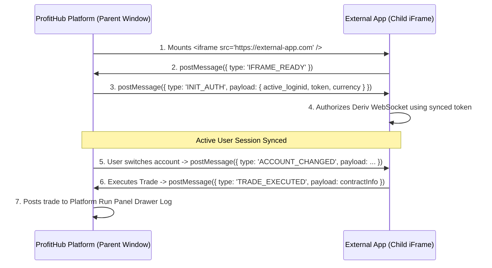

# 🌐 iFrame Integration & Auth Sync Developer Guide

This guide details how to build and embed external web applications inside the **ProfitHub Trading Platform** using `<iframe>` elements while maintaining synchronized user sessions, active account switching, real-time token authentication, and trade result logging to the platform's **Run Panel Drawer**.

---

## 🎯 **Key Capabilities**

1. **Seamless SSO & Account Sync**: Shared authentication tokens between parent platform and embedded child iFrames.
2. **Dynamic Account Switch Listener**: When users switch between Real/Demo accounts on ProfitHub, all active iFrames automatically re-authorize.
3. **Run Panel Drawer Dispatching**: Trades executed inside child iFrames are pushed directly to ProfitHub's global Run Panel drawer and summary cards.
4. **Dark / Light Theme Sync**: Parent theme state is propagated to child iFrames.

---

## 📐 **Architecture Workflow**



---

## 💻 **1. Parent Platform Integration (Host)**

Add the reusable `ExternalAppIFrame` React component to your platform:

### `src/components/iframe-wrapper/iframe-wrapper.tsx`

```tsx
import React, { useEffect, useRef } from 'react';
import { useStore } from '@/hooks/useStore';
import { api_base } from '@/external/bot-skeleton';

interface ExternalAppIFrameProps {
    src: string;
    title: string;
    allowedOrigins?: string[];
}

export const ExternalAppIFrame: React.FC<ExternalAppIFrameProps> = ({
    src,
    title,
    allowedOrigins = ['*'],
}) => {
    const iframeRef = useRef<HTMLIFrameElement>(null);
    const { transactions, run_panel, summary_card } = useStore();

    // Broadcast current auth context to child iframe
    const sendAuthToChild = () => {
        if (!iframeRef.current?.contentWindow) return;

        const activeLoginId = localStorage.getItem('active_loginid');
        const accountsListRaw = localStorage.getItem('accountsList');
        const accountsList = accountsListRaw ? JSON.parse(accountsListRaw) : {};
        const activeToken = accountsList[activeLoginId || '']?.token;

        const authPayload = {
            type: 'INIT_AUTH',
            payload: {
                active_loginid: activeLoginId,
                token: activeToken,
                currency: (api_base.account_info as any)?.currency || 'USD',
                accountsList,
            },
        };

        iframeRef.current.contentWindow.postMessage(authPayload, '*');
    };

    // Listen for events sent from child iframe
    useEffect(() => {
        const handleMessage = (event: MessageEvent) => {
            const { type, payload } = event.data || {};

            switch (type) {
                case 'IFRAME_READY':
                    sendAuthToChild();
                    break;

                case 'TRADE_EXECUTED':
                    try {
                        transactions.pushTransaction({ ...payload, run_id: run_panel.run_id });
                        run_panel.onBotContractEvent(payload);
                        summary_card.onBotContractEvent(payload);
                    } catch (err) {
                        console.warn('[Host] Run panel dispatch warning:', err);
                    }
                    break;

                case 'REQUEST_REAUTH':
                    sendAuthToChild();
                    break;

                default:
                    break;
            }
        };

        window.addEventListener('message', handleMessage);
        return () => window.removeEventListener('message', handleMessage);
    }, []);

    return (
        <iframe
            ref={iframeRef}
            src={src}
            title={title}
            allow="clipboard-read; clipboard-write; autoplay"
            style={{
                width: '100%',
                height: 'calc(100vh - 120px)',
                border: 'none',
                borderRadius: '12px',
                background: 'transparent',
            }}
            onLoad={sendAuthToChild}
        />
    );
};

export default ExternalAppIFrame;
```

---

## 🔌 **2. Child iFrame App Integration (External Web App)**

In your external web application (React, Vue, Vanilla JS), include the `AuthSyncClient` module:

### `child-app/src/auth-sync.ts`

```typescript
export interface HostAuthPayload {
    active_loginid: string;
    token: string;
    currency: string;
    accountsList: Record<string, { token: string; currency: string }>;
}

export class AuthSyncClient {
    public currentToken: string | null = null;
    public currentLoginId: string | null = null;
    public ws: WebSocket | null = null;

    constructor() {
        this.initMessageListener();
        // Signal readiness to Parent Platform
        if (window.parent !== window) {
            window.parent.postMessage({ type: 'IFRAME_READY' }, '*');
        }
    }

    private initMessageListener() {
        window.addEventListener('message', (event: MessageEvent) => {
            const { type, payload } = event.data || {};

            if (type === 'INIT_AUTH' || type === 'ACCOUNT_CHANGED') {
                this.handleAuthPayload(payload as HostAuthPayload);
            }
        });
    }

    private handleAuthPayload(data: HostAuthPayload) {
        console.log('[Child App] Auth Synced for Account:', data.active_loginid);
        this.currentToken = data.token;
        this.currentLoginId = data.active_loginid;

        // Re-authorize WebSocket session
        this.authorizeDerivWebSocket(data.token);
    }

    public authorizeDerivWebSocket(token: string) {
        if (this.ws) {
            try { this.ws.close(); } catch {}
        }

        // Connect to Deriv v3 WebSocket API
        this.ws = new WebSocket('wss://ws.derivws.com/websockets/v3?app_id=114292');
        this.ws.onopen = () => {
            this.ws?.send(JSON.stringify({ authorize: token }));
        };

        this.ws.onmessage = (evt) => {
            const msg = JSON.parse(evt.data);
            if (msg.msg_type === 'authorize') {
                console.log('[Child App] Deriv WS Authenticated Successfully:', msg.authorize.email);
            }
        };
    }

    /**
     * Dispatch executed trade contract result to ProfitHub's Run Panel Drawer Log
     */
    public postTradeToRunPanel(contractInfo: {
        contract_id: number | string;
        transaction_ids: { buy: number | string; sell?: number | string };
        contract_type: string;
        currency: string;
        buy_price: number;
        sell_price?: number;
        profit?: number;
        status: 'open' | 'won' | 'lost';
        symbol: string;
    }) {
        if (window.parent !== window) {
            window.parent.postMessage(
                {
                    type: 'TRADE_EXECUTED',
                    payload: contractInfo,
                },
                '*'
            );
        }
    }
}

export const authSyncClient = new AuthSyncClient();
```

---

## 🔒 **Security Recommendations**

1. **Origin Restricting**: In production, replace `targetOrigin = '*'` with your specific parent domain (e.g. `'https://profithub.site'`).
2. **CSP (Content Security Policy)**: Ensure host headers allow `frame-src https://*.your-external-app.com`.
3. **Storage Security**: Never store raw API tokens in unencrypted public variables; process them in memory within the class instance.
